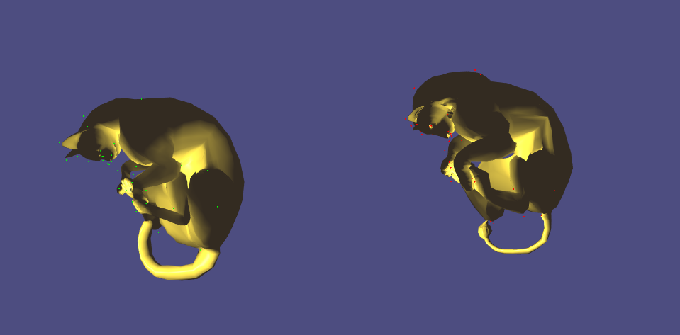

# Mesh_Deformation_Transfer
Libigl style code of SIGGRAPH paper "Deformation Transfer for Triangle Meshes" Robert W. Sumner, Jovan Popovic´, 2004.  
Transfer the deformation of Source mesh to the target mesh by several landmarks correspondences.  
Numerical optimization details are very clear in original paper, highly recommend to read.  
Have fun with it!  
  

