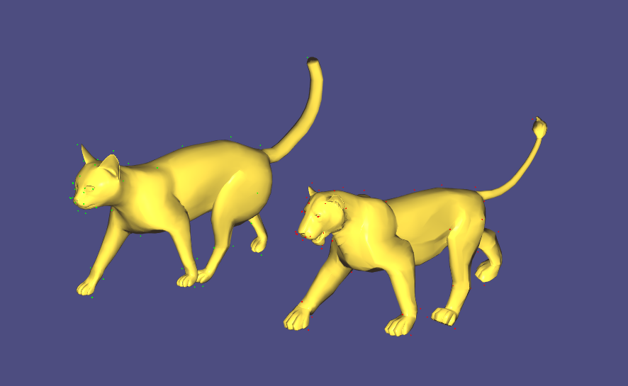

# Mesh_Deformation_Transfer
Libigl style code of SIGGRAPH paper "Deformation Transfer for Triangle Meshes" Robert W. Sumner, Jovan Popovic´, 2004.  
Transfer the deformation of Source mesh to the Target mesh with several landmarks correspondences.  
Numerical optimization details are very clear in original paper, highly recommend to read. Have fun!  

## Left Source: Cat, Right Target: Lion
 
## Deformation Transfer Results

